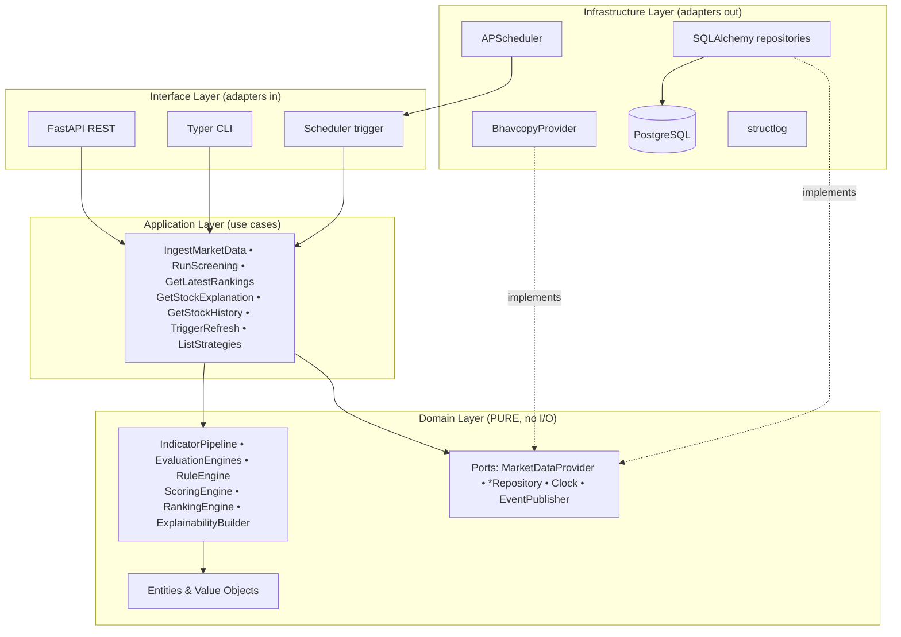
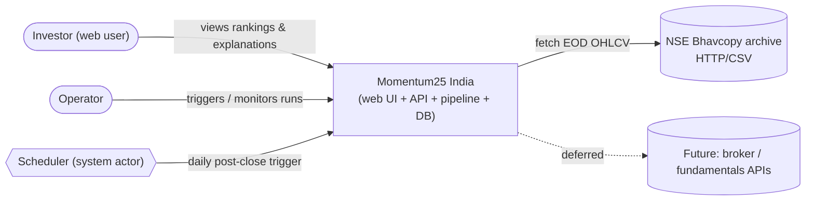
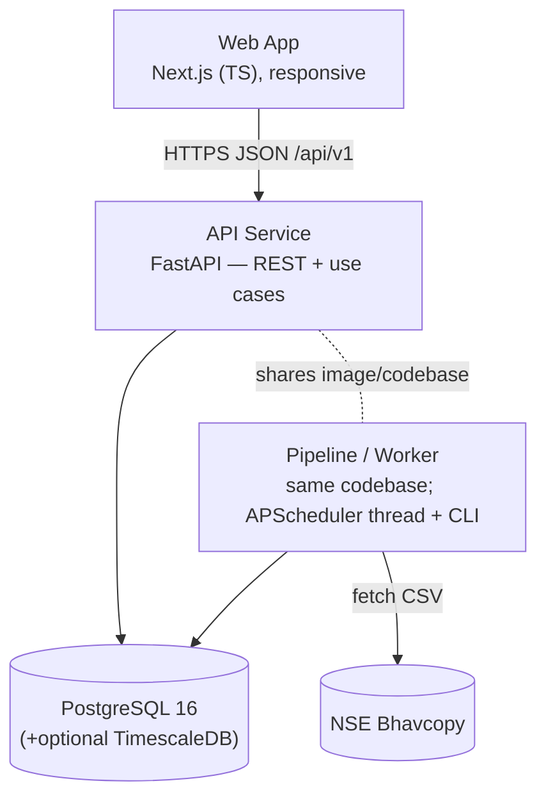
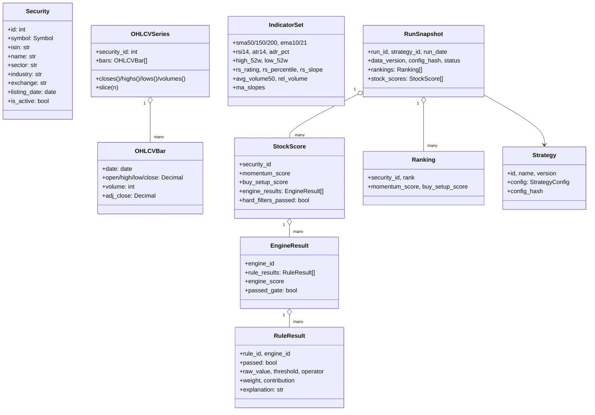
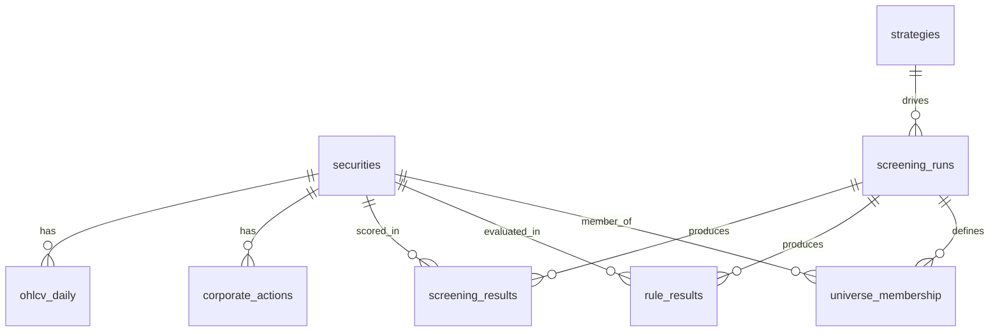
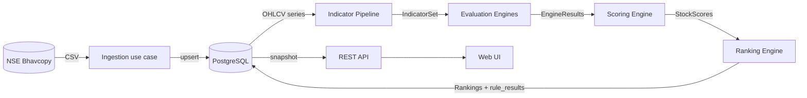
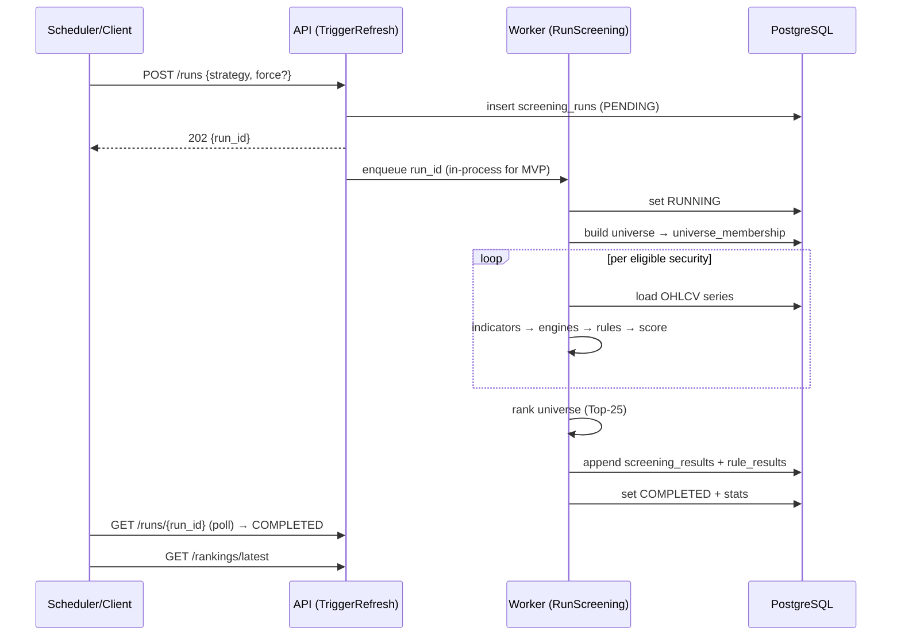
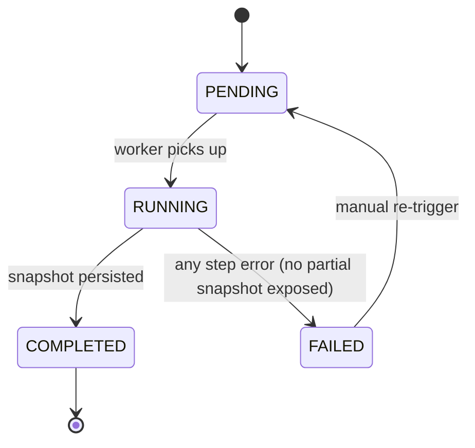
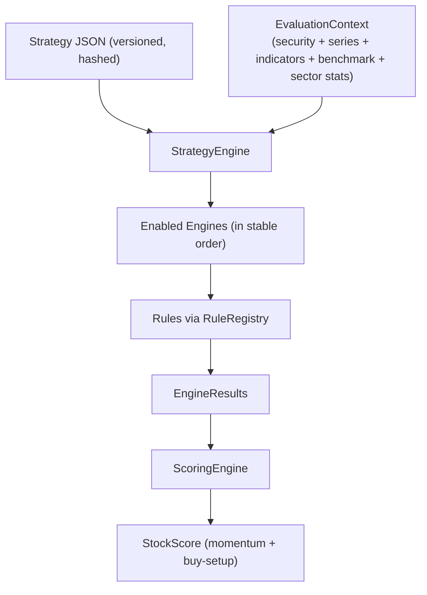

# Momentum25 India — Architecture Design Document (ADD)

> **Status:** Approved blueprint (Phase 2). Implementation follows the roadmap in §27.
> **Audience:** Senior engineers and an implementing LLM. Companion document: [`IMPLEMENTATION_SPEC.md`](./IMPLEMENTATION_SPEC.md).
> **Repository state at authoring:** greenfield (empty).

---

## Table of Contents
1. [Executive Summary](#1-executive-summary)
2. [Functional Requirements](#2-functional-requirements)
3. [Non-Functional Requirements](#3-non-functional-requirements)
4. [Product Scope](#4-product-scope)
5. [MVP Definition](#5-mvp-definition)
6. [Deferred Features & Extension Points](#6-deferred-features--extension-points)
7. [High-Level Architecture](#7-high-level-architecture)
8. [System Context Diagram (C4 L1)](#8-system-context-diagram-c4-l1)
9. [Container Diagram (C4 L2)](#9-container-diagram-c4-l2)
10. [Module Decomposition](#10-module-decomposition)
11. [Domain Model](#11-domain-model)
12. [Data Model](#12-data-model)
13. [Component Responsibilities](#13-component-responsibilities)
14. [API Architecture](#14-api-architecture)
15. [Data Flow](#15-data-flow)
16. [Refresh Workflow](#16-refresh-workflow)
17. [Technical Indicator Pipeline](#17-technical-indicator-pipeline)
18. [Strategy Engine Architecture](#18-strategy-engine-architecture)
19. [Rule Engine Architecture](#19-rule-engine-architecture)
20. [Pattern Recognition Architecture](#20-pattern-recognition-architecture)
21. [Scoring & Ranking Architecture](#21-scoring--ranking-architecture)
22. [Explainability Architecture](#22-explainability-architecture)
23. [Persistence Architecture](#23-persistence-architecture)
24. [Security, Deployment, Mobile, Scalability, Extensibility](#24-cross-cutting-architecture)
25. [Risks and Trade-offs](#25-risks-and-trade-offs)
26. [Architecture Decision Records](#26-architecture-decision-records)
27. [Implementation Roadmap](#27-implementation-roadmap)

---

## 1. Executive Summary

Momentum25 India is a **modular, deterministic quant screening platform** that identifies, ranks, and *explains* the highest-quality momentum stocks on the Indian (NSE) market. A daily pipeline ingests official NSE end-of-day (EOD) data, maintains an eligible universe, computes technical indicators, evaluates every stock through a set of independent **Evaluation Engines**, combines their outputs via a configurable **Scoring Engine** into a **Momentum Score** and a **Buy Setup Score**, **ranks** the universe, and persists an **immutable snapshot** per run. **Every score is fully explainable**: each rule records pass/fail, raw value, threshold, weight, and contribution.

The methodology is inspired by Mark Minervini's objective Trend Template / SEPA principles, but the platform is **strategy-agnostic** — Minervini is the first strategy expressed as configuration, not the only one hard-coded into the system.

**Architecture style:** Clean / Hexagonal (Ports & Adapters). The domain + application core is a **pure, I/O-free function** of (market data + strategy config). All I/O — data providers, persistence, scheduling, HTTP — lives in adapters behind ports. This guarantees determinism and testability and lets data sources, storage, and clients be replaced without touching business logic.

**Key decisions:** Python 3.12 / FastAPI backend; Next.js (TypeScript) web; PostgreSQL (+optional TimescaleDB); NSE Bhavcopy as the MVP data adapter; daily scheduled + on-demand refresh; local/self-hosted Docker Compose deployment; no auth in MVP with SaaS seams pre-built.

---

## 2. Functional Requirements

| ID | Requirement | MVP | Notes |
|----|-------------|-----|-------|
| FR-1 | Fetch market data from configurable provider(s) | ✅ | Bhavcopy adapter behind `MarketDataProvider` port |
| FR-2 | Maintain eligible stock universe | ✅ | Liquidity/price/listing/history filters |
| FR-3 | Compute all required technical indicators | ✅ | Pure indicator functions |
| FR-4 | Evaluate every stock via configurable rule engine | ✅ | Strategy = JSON config |
| FR-5 | Detect high-quality momentum setups | ✅ | Trend/RS/volume/breakout; patterns partial |
| FR-6 | Deterministic Momentum Score | ✅ | Stable-order weighted reduction |
| FR-7 | Deterministic Buy Setup Score | ✅ | Setup-focused weighting |
| FR-8 | Objective ranking | ✅ | Deterministic stable sort |
| FR-9 | Display Top 25 | ✅ | Web UI + API |
| FR-10 | Persist historical rankings/scores/snapshots | ✅ | Append-only run snapshots |
| FR-11 | Explain every score and ranking | ✅ | Per-rule rationale persisted |
| FR-12 | Scheduled + on-demand refresh | ✅ | APScheduler + `POST /runs` |
| FR-13 | Multiple strategies via config | Engine ✅ | 2nd strategy deferred |
| FR-14 | Pattern recognition (VCP, Cup&Handle, …) | Framework ✅ | VCP + Flat Base in MVP |
| FR-15 | Fundamental screening | ⛔ deferred | Port + disabled engine defined |
| FR-16 | Sector/industry relative strength | ✅ | Basic peer-rank |

## 3. Non-Functional Requirements

- **Determinism (NFR-1):** same data + same config ⇒ identical output. No wall-clock, randomness, or order-dependent float reductions in scoring.
- **Reproducibility (NFR-2):** each run stores `config_hash` + `data_version`; recompute must byte-match.
- **Explainability (NFR-3):** no score without a stored rationale.
- **Testability (NFR-4):** quant core has zero I/O; ≥90% unit coverage on indicators/rules/scoring via golden-master fixtures.
- **Performance (NFR-5):** full eligible NSE universe (~2,000 symbols × ~2 yrs) screened in < 3 minutes on a laptop-class host.
- **Maintainability (NFR-6):** change a threshold = config edit; add a rule = one class + registry entry.
- **Portability (NFR-7):** Docker Compose on a single host; no managed-cloud dependency for MVP.
- **Extensibility (NFR-8):** new provider/strategy/rule/pattern/client without core changes.
- **Security (NFR-9):** secrets via env; validation at API boundary; auth-ready.
- **Observability (NFR-10):** structured logs, per-run metrics, health endpoints.

## 4. Product Scope

**In scope (MVP):** NSE equities; daily EOD; one configured strategy (Minervini Trend Template + RS + volume + breakout + risk); Top-25 ranking with full explainability; historical snapshots; responsive web UI; on-demand + scheduled refresh; local self-hosted deployment.

**Explicitly out of scope (MVP):** authentication/multi-tenancy/billing; fundamentals; intraday/real-time; broker adapters; advanced patterns (Cup & Handle, Ascending Base, High Tight Flag); backtesting; alerts/notifications; mobile app; BSE.

## 5. MVP Definition

A user opens the responsive web app and sees the **Top 25 NSE momentum stocks** for the latest completed daily run. Clicking any stock shows its **full score breakdown** (every rule, pass/fail, value vs threshold, weighted contribution), a rationale, and a **score/rank history** chart. The user can trigger an **on-demand refresh**; a **scheduler** runs the screen automatically after each market close. All output is deterministic, reproducible, and explained.

## 6. Deferred Features & Extension Points

| Deferred capability | Pre-built extension point |
|---|---|
| Auth / multi-tenant SaaS | `tenant_id` nullable column convention + `CurrentUser` API dependency seam; all queries tenant-scopable |
| Fundamentals | `FundamentalDataProvider` port + `FundamentalScreeningEngine` (registered, disabled by config) |
| Intraday / real-time | `MarketDataProvider` port is interval-parametric; pipeline parameterized by bar interval |
| Broker adapters | New class implementing `MarketDataProvider`, selected via config |
| Advanced chart patterns | New `PatternDetector` implementations in the pattern registry |
| Backtesting | Pure scoring core re-runs over historical snapshots |
| Mobile clients | Same versioned REST/JSON API; OpenAPI-generated TS client shared with web |
| Alerts / webhooks | `RunCompleted` domain event → pluggable `EventPublisher` notifier |

---

## 7. High-Level Architecture

**Style:** Clean / Hexagonal. Dependencies point **inward**. The domain + application core is pure (no I/O). Adapters implement domain **ports**.



**The dependency rule (enforced via import-linter):** `domain` imports nothing outward; `application` imports `domain`; `infrastructure`/`interface` import `application` + `domain`.

## 8. System Context Diagram (C4 L1)



## 9. Container Diagram (C4 L2)



> MVP packaging: `api` and `worker` share one image (worker = scheduler thread + CLI). Compose services: `api`, `db`, optional `web`. Worker is separable into its own process/queue later with no code change.

## 10. Module Decomposition

```
momentum25/
├─ domain/
│  ├─ entities/        Security, OHLCVBar, OHLCVSeries, RunSnapshot, Ranking
│  ├─ value_objects/   Symbol, Percentage, RuleResult, EngineResult, StockScore,
│  │                   IndicatorSet, Threshold, Weight, EvaluationContext
│  ├─ indicators/      sma, ema, rsi, atr, adr, slope, high_low_52w, rs_rating, volume
│  ├─ engines/         trend_template, relative_strength, volume_accumulation,
│  │                   pattern, breakout, momentum_quality, risk, fundamental(stub)
│  ├─ rules/           Rule base, RuleRegistry, rule implementations
│  ├─ patterns/        PatternDetector base, vcp, flat_base, registry
│  ├─ scoring/         ScoringEngine, RankingEngine, ExplainabilityBuilder
│  ├─ strategy/        Strategy, StrategyConfig, RuleSet, StrategyEngine
│  └─ ports/           MarketDataProvider, *Repository, Clock, EventPublisher
├─ application/
│  ├─ use_cases/       IngestMarketData, RunScreening, GetLatestRankings,
│  │                   GetStockExplanation, GetStockHistory, TriggerRefresh, ListStrategies
│  └─ dto/             request/response DTOs
├─ infrastructure/
│  ├─ providers/       BhavcopyProvider, instrument master loader
│  ├─ persistence/     SQLAlchemy models, repositories, Alembic migrations
│  ├─ scheduler/       APScheduler config + jobs
│  ├─ config/          Pydantic Settings, strategy JSON loader
│  └─ logging/         structlog setup
├─ interface/
│  ├─ api/             FastAPI routers, dependencies, error handlers
│  └─ cli/             typer commands: ingest, screen, list-runs
└─ main.py             app/composition root
```

## 11. Domain Model



**Determinism guarantees:** indicators persisted at fixed precision (Decimal); scoring reduces rule contributions in a **stable `rule_id` order**; comparisons use explicit thresholds + tolerances; `RunSnapshot` is immutable once `COMPLETED`.

## 12. Data Model

See [`IMPLEMENTATION_SPEC.md` §4](./IMPLEMENTATION_SPEC.md#4-database-schema-ddl) for full DDL. Entity-relationship overview:



Key tables: `securities`, `ohlcv_daily`, `corporate_actions`, `benchmark_index_daily`, `strategies`, `screening_runs`, `universe_membership`, `screening_results`, `rule_results`. Run result tables are **append-only per `run_id`** → free history + audit.

## 13. Component Responsibilities

Every evaluation engine implements the common port (pure, no I/O):

```python
class EvaluationEngine(Protocol):
    engine_id: str
    def evaluate(self, ctx: EvaluationContext, cfg: EngineConfig) -> EngineResult: ...
```

| Engine | Purpose | Key outputs | MVP |
|---|---|---|---|
| **Indicator Pipeline** | Compute `IndicatorSet` per security/run | SMA/EMA/RSI/ATR/ADR/52w/RS/volume | ✅ |
| **Trend Template** | Minervini 8-point trend gate | 8 RuleResults + gate | ✅ |
| **Relative Strength** | RS rating/percentile, sector/industry-relative | RS rules | ✅ |
| **Volume & Accumulation** | Liquidity, accumulation/distribution, breakout volume | volume rules | ✅ |
| **Pattern Recognition** | Detect base structures | pattern detections | VCP + Flat Base |
| **Breakout** | Pivot/breakout quality, follow-through, false-breakout | breakout rules | ✅ |
| **Momentum Quality** | Persistence, acceleration, MTF confirmation | quality rules | ✅ |
| **Risk** | ATR, extension, stop, R:R, position sizing | risk rules | ✅ |
| **Fundamental** | EPS/revenue/ROE/margins/ownership | fundamental rules | ⛔ port only |
| **Scoring** | Weighted combine → momentum & buy-setup scores | StockScore | ✅ |
| **Ranking** | Deterministic ordering | Ranking[] | ✅ |
| **Explainability** | Per-rule rationale + history | explanations | ✅ |

Full per-module Purpose/Responsibilities/Inputs/Outputs/Dependencies/Constraints/Errors/Extension tables are in [`IMPLEMENTATION_SPEC.md` §7](./IMPLEMENTATION_SPEC.md#7-module-specifications).

## 14. API Architecture

REST, versioned `/api/v1`, JSON. Auto-generated OpenAPI (FastAPI). RFC-7807 problem+json errors; ETag on immutable run resources; pagination on collections. Full contracts in [`IMPLEMENTATION_SPEC.md` §5](./IMPLEMENTATION_SPEC.md#5-api-contracts).

| Method | Path | Purpose |
|---|---|---|
| GET | `/api/v1/health` | liveness/readiness |
| GET | `/api/v1/rankings/latest?strategy=&limit=25` | latest completed run Top-N |
| GET | `/api/v1/rankings/{run_id}` | rankings for a run |
| GET | `/api/v1/stocks/{symbol}?run_id=` | detail + full explainability |
| GET | `/api/v1/stocks/{symbol}/history?strategy=` | score/rank over time |
| GET | `/api/v1/runs` | list runs (paginated) |
| POST | `/api/v1/runs` | trigger refresh `{strategy, force?}` |
| GET | `/api/v1/runs/{id}` | run status/stats |
| GET | `/api/v1/strategies` / `/strategies/{id}` | list/inspect strategies |
| GET | `/api/v1/securities/{symbol}/ohlcv?from=&to=` | price series for charts |

## 15. Data Flow



## 16. Refresh Workflow



**State machine for a run:**



Idempotent on `(strategy, data_version)` unless `force=true`. On failure, previous COMPLETED snapshots remain intact and exposed.

## 17. Technical Indicator Pipeline

Pure functions over `OHLCVSeries` → `IndicatorSet`. Indicators: SMA(50/150/200), EMA(10/21), RSI(14), ATR(14), ADR%(20), 52-week high/low + distances, MA slopes (linear regression over N sessions), average volume(50), relative volume, RS rating/percentile (computed across the universe within a run), RS-line slope. **Insufficient history ⇒ indicator `None` and the security is flagged ineligible**, never a crash. New indicators are added as pure functions with golden-master tests.

## 18. Strategy Engine Architecture

A **Strategy** is a versioned JSON config (stored in `strategies.config`, hashed to `config_hash`) specifying enabled engines, per-engine rule sets, thresholds, weights, gates, and scoring weights. The **StrategyEngine** orchestrates: for a given strategy + `EvaluationContext`, it runs engines → rules → scoring → ranking. Adding a strategy = a new JSON row; changing one = a config edit. No core redesign.



## 19. Rule Engine Architecture

A **Rule** is `{id, engine_id, evaluate(ctx, params) -> RuleResult, default_params, weight}` — pure, independently testable and explainable. Rules self-register in a **RuleRegistry** (`rule_id → Rule`). A `RuleResult` always carries pass/fail, raw value, threshold, operator, weight, contribution, and an explanation string. Gates are rules (or engines) marked as **hard filters**: failing a gate excludes a stock from ranking but it is still scored and explained ("filtered out, reason …").

## 20. Pattern Recognition Architecture

`PatternDetector` registry, each detector pure: `detect(ctx, params) -> PatternResult{detected, quality_score, pivot, explanation}`. **MVP detectors:** VCP (sequence of contractions with decreasing depth + volume dry-up) and Flat Base (tight range near highs). Patterns are **additive signals**, not hard gates (mitigates false positives). Deferred: Cup & Handle, Ascending Base, High Tight Flag, Consolidation — each a new detector, no core change.

## 21. Scoring & Ranking Architecture

- `engine_score = Σ(rule.weight · rule.normalized_value)` in stable `rule_id` order.
- `momentum_score = Σ(engine_weight · engine_score)`, normalized to a 0–100 scale.
- `buy_setup_score` = setup-focused subset (breakout proximity, base quality, low extension, volume confirmation).
- **Hard filters:** Trend Template + liquidity must pass or the stock is excluded from ranking (still scored + explained).
- **Ranking:** stable sort by `momentum_score` desc → tie-break `buy_setup_score` → `rs_rating` → `symbol`. Top-25 = `rank ≤ 25`. Fully deterministic.

## 22. Explainability Architecture

Explainability is a **first-class output**, not a derived afterthought. Each `RuleResult` is persisted to `rule_results` with its value, threshold, weight, contribution, and explanation, making rationales immutable per run. The `ExplainabilityBuilder` assembles, per stock: which rules passed/failed, each rule's contribution, an overall rationale, and (via history query) score/rank movement across runs. **NFR-3: no score is ever returned without its explanation.**

## 23. Persistence Architecture

PostgreSQL 16; SQLAlchemy 2.0 (async) + Alembic. Optional TimescaleDB hypertable for `ohlcv_daily` behind a config flag (plain table is sufficient at MVP scale). Repositories implement domain ports; ORM models never leak into the domain (mapping lives in infrastructure). Run snapshots are append-only → trivial history and audit.

## 24. Cross-cutting Architecture

**Security:** MVP has no auth (local). Secrets via env/`.env` (never committed); Pydantic validation at the API edge; ORM-only SQL; CORS locked to known origins; rate-limit hook ready. SaaS path: JWT/OAuth2 FastAPI dependencies, `tenant_id` scoping, per-tenant limits, audit log — no rearchitecture.

**Deployment:** MVP = Docker Compose (`db`, `api` with scheduler thread, optional `web`) on one host; Alembic migrations on startup; `.env` config. SaaS path: split worker (Celery/Arq + Redis), managed Postgres, orchestration, web CDN — ports already abstract scheduling/queue.

**Mobile readiness:** all business logic is server-side behind a stable versioned REST/JSON API; the web app is a thin client. A future React Native app consumes the same API; an OpenAPI-generated TypeScript client is shared by web and mobile. No backend change required.

**Scalability:** MVP scale is single-host trivial. The compute bottleneck (per-symbol indicators/rules) is embarrassingly parallel (process pool). `ohlcv_daily` partitions by time (Timescale) when needed. The API is stateless (scales horizontally); the worker scales out via a queue; snapshots are read-mostly (cache/CDN friendly).

**Extensibility:** ports + registries everywhere (`MarketDataProvider`, `PatternDetector`, `EvaluationEngine`, `Rule`, `Strategy` JSON). New capability = new adapter/registry entry + config. Domain events (`RunCompleted`) enable alerts/webhooks.

## 25. Risks and Trade-offs

| Risk | Mitigation |
|---|---|
| Bhavcopy format/URL changes | Provider isolated behind port; contract tests + parser versioning |
| Corporate-action accuracy (splits/bonus) | Explicit `corporate_actions` + adjusted series; validate vs known events |
| RS rating needs full universe | Compute RS after universe load; percentile within the run |
| Pattern false positives | Ship only VCP + Flat Base; patterns are additive, not gates |
| Float non-determinism | Decimal at persistence, stable-order reductions, fixed rounding, golden tests |
| In-process scheduler limits | Acceptable for MVP; queue extension point defined |
| Methodology over-fitting | Strategy is config; thresholds tunable; a 2nd strategy validates generality |
| Single-host failure | Acceptable for local MVP; SaaS path adds redundancy |

## 26. Architecture Decision Records

Summarized here; full records in [`adr/`](./adr/).

| ADR | Decision | Rationale (rejected alt) |
|---|---|---|
| 001 | Hexagonal/Clean architecture | Pure quant core for determinism + testability (vs layered MVC coupling I/O to logic) |
| 002 | Python 3.12 / FastAPI backend | Best quant ecosystem + typing (vs TS end-to-end weaker TA; Java heavier) |
| 003 | NSE Bhavcopy MVP provider | Free, official, full-universe EOD (vs broker auth/cost; vendor cost) |
| 004 | PostgreSQL (+optional Timescale) | Relational integrity + time-series (vs pure TSDB; SQLite concurrency) |
| 005 | Strategy as versioned JSON + rule registry | Change strategy without code (vs hard-coded) |
| 006 | Append-only immutable run snapshots | Reproducibility + free history/audit (vs mutable latest-only) |
| 007 | In-process APScheduler, queue-ready | Minimal infra now, scalable later |
| 008 | API-first, thin clients | Mobile readiness with no backend change |
| 009 | Determinism contract | Reproducible scores (Decimal, stable order, config_hash + data_version) |
| 010 | No auth in MVP, seams pre-built | Speed now, SaaS later without rearchitecture |

## 27. Implementation Roadmap

Each milestone leaves the app working and is independently testable.

| Milestone | Deliverable | Verification |
|---|---|---|
| **M0 Scaffolding** | Repo, package layout, Settings, Docker Compose (db+api), structlog, import-linter, CI (pytest), Alembic baseline | `/health` green; migrations apply |
| **M1 Ingestion** | `MarketDataProvider` port + `BhavcopyProvider`, instrument master, `ohlcv_daily` upsert, corporate-action adjust, CLI `ingest` | Golden parse fixtures; idempotency |
| **M2 Indicators** | Pure indicator functions + `IndicatorSet`; universe builder | Golden-master indicator values |
| **M3 Trend+RS+Scoring** | Rule base+registry, Trend Template, RS engine, Scoring/Ranking/Explainability; Minervini strategy JSON | Deterministic scores on fixture universe |
| **M4 Run+Persistence** | `RunScreening` use case, snapshot persistence, run lifecycle, CLI `screen` | E2E run → Top-25 + rule_results; reproducible |
| **M5 REST API** | Rankings/stock/runs/strategies endpoints, DTOs, errors, OpenAPI | Contract tests |
| **M6 Web UI** | Top-25 table, stock detail w/ rule breakdown, history chart, refresh, run status | E2E against API |
| **M7 Scheduler** | APScheduler post-close ingest+screen | Triggered job produces a run |
| **M8 More engines+patterns** | Volume/Breakout/Momentum/Risk engines + VCP/Flat Base; buy-setup score; explainability UI | Per-engine unit + golden |
| **Deferred** | Auth/multi-tenant, fundamentals, advanced patterns, intraday, broker adapters, backtesting, alerts, mobile | — |
