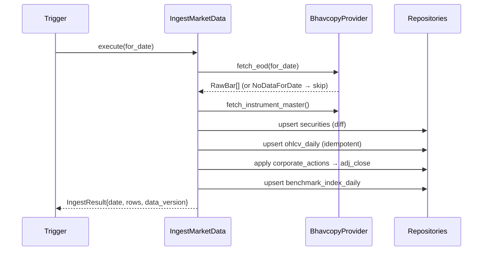

# Momentum25 India — Implementation Specification

> **Purpose:** Remove ambiguity so a capable engineer or LLM can implement the MVP with minimal additional architectural decisions. Companion to [`ADD.md`](./ADD.md).
> Pseudocode and interface signatures are provided **instead of** implementation code. Python signatures are illustrative type contracts (Python 3.12, Pydantic v2, SQLAlchemy 2.0 async).

## Contents
1. [Technology Stack](#1-technology-stack)
2. [Project Folder Structure](#2-project-folder-structure)
3. [Domain Models, DTOs & Entity Relationships](#3-domain-models-dtos--entity-relationships)
4. [Database Schema (DDL)](#4-database-schema-ddl)
5. [API Contracts](#5-api-contracts)
6. [Service, Repository & Port Interfaces](#6-service-repository--port-interfaces)
7. [Module Specifications](#7-module-specifications)
8. [Indicator Definitions (exact formulas)](#8-indicator-definitions-exact-formulas)
9. [Rule Catalogue (Minervini strategy)](#9-rule-catalogue-minervini-strategy)
10. [Scoring & Ranking Specification](#10-scoring--ranking-specification)
11. [Workflows (sequence & state)](#11-workflows-sequence--state)
12. [Configuration Model](#12-configuration-model)
13. [Error Handling Strategy](#13-error-handling-strategy)
14. [Auth & Authorization Model](#14-auth--authorization-model)
15. [Logging & Observability](#15-logging--observability)
16. [Deployment](#16-deployment)
17. [Testing Strategy](#17-testing-strategy)
18. [Extension Points](#18-extension-points)

---

## 1. Technology Stack

| Concern | Choice | Justification |
|---|---|---|
| Language | Python 3.12 | Best ecosystem for deterministic quant (numpy/pandas), strong typing via Pydantic v2 |
| Web framework | FastAPI | Async, auto OpenAPI, Pydantic-native, DI via `Depends` |
| Validation/serialization | Pydantic v2 | Settings + DTOs + strict typing |
| Numeric | numpy + `decimal.Decimal` | numpy for vectorized indicators; Decimal at persistence boundary for determinism |
| ORM | SQLAlchemy 2.0 (async) | Mature, typed, repository-friendly |
| Migrations | Alembic | Versioned schema |
| DB | PostgreSQL 16 (+ optional TimescaleDB) | Relational integrity + time-series option |
| Scheduler | APScheduler (AsyncIOScheduler) | In-process, zero extra infra for MVP; swappable to Celery/Arq |
| CLI | Typer | Ergonomic commands for ingest/screen |
| Logging | structlog | Structured JSON logs |
| HTTP client | httpx | Async fetch of Bhavcopy |
| Testing | pytest + pytest-asyncio + syrupy (snapshots) | Golden-master determinism tests |
| Lint/format/types | ruff + mypy (strict) + import-linter | Quality + dependency-rule enforcement |
| Web app | Next.js (App Router, TS) + TanStack Query + Tailwind + shadcn/ui | Responsive, typed API client, fast iteration |
| Charts | lightweight-charts (price) + Recharts (scores) | Finance-grade + general charts |
| Packaging | Docker + Docker Compose | Reproducible local self-hosting |
| Dep mgmt | uv (or Poetry) | Fast, lockfile-based |

**Determinism rules (MANDATORY):**
- All persisted numeric values are `Decimal` quantized to fixed precision: prices `0.01`, scores `0.0001`, percentages `0.01`.
- No `set` iteration or dict-order reliance in scoring; iterate rules in sorted `rule_id` order.
- No wall-clock / RNG inside the domain core. `Clock` is a port; the run uses `run_date` from data.
- Float math allowed inside indicators (numpy) but results are quantized to Decimal before they reach scoring/persistence.

## 2. Project Folder Structure

```
StocksMomentum/
├─ backend/
│  ├─ pyproject.toml
│  ├─ alembic.ini
│  ├─ src/momentum25/
│  │  ├─ domain/{entities,value_objects,indicators,engines,rules,patterns,scoring,strategy,ports}/
│  │  ├─ application/{use_cases,dto}/
│  │  ├─ infrastructure/{providers,persistence,scheduler,config,logging}/
│  │  ├─ interface/{api,cli}/
│  │  └─ main.py
│  ├─ migrations/            # Alembic
│  └─ tests/{unit,integration,golden,fixtures}/
├─ web/                      # Next.js app
│  ├─ package.json
│  └─ src/{app,components,lib,api-client}/
├─ docs/architecture/        # ADD.md, IMPLEMENTATION_SPEC.md, adr/, strategies/
├─ docker-compose.yml
├─ .env.example
└─ README.md
```

## 3. Domain Models, DTOs & Entity Relationships

### Value Objects (Pydantic frozen models / dataclasses)
```python
class Symbol(str): ...  # validated NSE symbol, uppercase

@dataclass(frozen=True)
class OHLCVBar:
    date: date
    open: Decimal; high: Decimal; low: Decimal; close: Decimal
    volume: int
    adj_close: Decimal | None = None

@dataclass(frozen=True)
class IndicatorSet:
    as_of: date
    sma50: Decimal | None; sma150: Decimal | None; sma200: Decimal | None
    ema10: Decimal | None; ema21: Decimal | None
    rsi14: Decimal | None; atr14: Decimal | None; adr_pct: Decimal | None
    high_52w: Decimal | None; low_52w: Decimal | None
    pct_above_low_52w: Decimal | None; pct_below_high_52w: Decimal | None
    sma200_slope_pct: Decimal | None         # over slope window
    rs_rating: int | None                    # 1..99 percentile vs universe
    rs_percentile: Decimal | None
    rs_line_slope: Decimal | None
    avg_volume50: Decimal | None
    rel_volume: Decimal | None

@dataclass(frozen=True)
class RuleResult:
    rule_id: str; engine_id: str
    passed: bool
    raw_value: Decimal | None
    threshold: Decimal | None
    operator: str            # ">", ">=", "<", "between", "bool"
    weight: Decimal
    contribution: Decimal    # weight * normalized_value
    explanation: str

@dataclass(frozen=True)
class EngineResult:
    engine_id: str
    rule_results: tuple[RuleResult, ...]
    engine_score: Decimal
    passed_gate: bool

@dataclass(frozen=True)
class StockScore:
    security_id: int
    momentum_score: Decimal
    buy_setup_score: Decimal
    engine_results: tuple[EngineResult, ...]
    hard_filters_passed: bool

@dataclass(frozen=True)
class Ranking:
    security_id: int; rank: int
    momentum_score: Decimal; buy_setup_score: Decimal

@dataclass(frozen=True)
class EvaluationContext:
    security: Security
    series: OHLCVSeries
    indicators: IndicatorSet
    benchmark: OHLCVSeries
    sector_stats: SectorStats     # peer RS distributions
    universe_rs: UniverseRSStats  # for percentile lookups
```

### DTOs (API boundary)
```python
class RankingItemDTO(BaseModel):
    rank: int; symbol: str; name: str
    momentum_score: Decimal; buy_setup_score: Decimal
    sector: str | None; rs_rating: int | None

class RuleResultDTO(BaseModel):
    rule_id: str; label: str; engine_id: str
    passed: bool; value: Decimal | None; threshold: Decimal | None
    operator: str; weight: Decimal; contribution: Decimal; explanation: str

class EngineBreakdownDTO(BaseModel):
    engine_id: str; engine_score: Decimal; passed_gate: bool
    rules: list[RuleResultDTO]

class StockExplanationDTO(BaseModel):
    symbol: str; name: str; run_id: int; run_date: date
    momentum_score: Decimal; buy_setup_score: Decimal
    hard_filters_passed: bool
    engines: list[EngineBreakdownDTO]
    rationale: str
    history_summary: list[ScorePointDTO]   # {run_date, rank, momentum_score}

class RunDTO(BaseModel):
    id: int; status: str; run_date: date; trigger: str
    strategy: str; data_version: str; config_hash: str
    started_at: datetime | None; finished_at: datetime | None
    stats: dict | None; error: str | None
```

## 4. Database Schema (DDL)

```sql
CREATE TABLE securities (
  id           BIGSERIAL PRIMARY KEY,
  symbol       TEXT NOT NULL UNIQUE,
  isin         TEXT,
  name         TEXT NOT NULL,
  sector       TEXT,
  industry     TEXT,
  exchange     TEXT NOT NULL DEFAULT 'NSE',
  listing_date DATE,
  is_active    BOOLEAN NOT NULL DEFAULT TRUE,
  tenant_id    BIGINT,                    -- SaaS extension point (nullable in MVP)
  created_at   TIMESTAMPTZ NOT NULL DEFAULT now(),
  updated_at   TIMESTAMPTZ NOT NULL DEFAULT now()
);

CREATE TABLE ohlcv_daily (
  security_id BIGINT NOT NULL REFERENCES securities(id),
  date        DATE   NOT NULL,
  open        NUMERIC(18,4) NOT NULL,
  high        NUMERIC(18,4) NOT NULL,
  low         NUMERIC(18,4) NOT NULL,
  close       NUMERIC(18,4) NOT NULL,
  volume      BIGINT        NOT NULL,
  adj_close   NUMERIC(18,4),
  adj_factor  NUMERIC(18,8) NOT NULL DEFAULT 1,
  PRIMARY KEY (security_id, date)
);
-- Optional: SELECT create_hypertable('ohlcv_daily','date'); (TimescaleDB)

CREATE TABLE corporate_actions (
  id          BIGSERIAL PRIMARY KEY,
  security_id BIGINT NOT NULL REFERENCES securities(id),
  ex_date     DATE   NOT NULL,
  type        TEXT   NOT NULL,            -- SPLIT|BONUS|DIVIDEND
  ratio       NUMERIC(18,8),
  raw         JSONB,
  UNIQUE (security_id, ex_date, type)
);

CREATE TABLE benchmark_index_daily (
  index_code TEXT NOT NULL,               -- e.g. 'NIFTY500'
  date       DATE NOT NULL,
  close      NUMERIC(18,4) NOT NULL,
  PRIMARY KEY (index_code, date)
);

CREATE TABLE strategies (
  id          BIGSERIAL PRIMARY KEY,
  name        TEXT NOT NULL,
  version     INTEGER NOT NULL,
  is_active   BOOLEAN NOT NULL DEFAULT TRUE,
  config      JSONB NOT NULL,
  config_hash TEXT NOT NULL,
  created_at  TIMESTAMPTZ NOT NULL DEFAULT now(),
  UNIQUE (name, version)
);

CREATE TABLE screening_runs (
  id           BIGSERIAL PRIMARY KEY,
  strategy_id  BIGINT NOT NULL REFERENCES strategies(id),
  run_date     DATE   NOT NULL,
  data_version TEXT   NOT NULL,           -- latest bhavcopy date used
  config_hash  TEXT   NOT NULL,
  status       TEXT   NOT NULL,           -- PENDING|RUNNING|COMPLETED|FAILED
  trigger      TEXT   NOT NULL,           -- SCHEDULED|MANUAL
  started_at   TIMESTAMPTZ,
  finished_at  TIMESTAMPTZ,
  error        TEXT,
  stats        JSONB,
  UNIQUE (strategy_id, run_date, data_version, config_hash)
);
CREATE INDEX idx_runs_status_date ON screening_runs(status, run_date DESC);

CREATE TABLE universe_membership (
  run_id      BIGINT NOT NULL REFERENCES screening_runs(id),
  security_id BIGINT NOT NULL REFERENCES securities(id),
  eligible    BOOLEAN NOT NULL,
  reason      TEXT,
  PRIMARY KEY (run_id, security_id)
);

CREATE TABLE screening_results (
  run_id              BIGINT NOT NULL REFERENCES screening_runs(id),
  security_id         BIGINT NOT NULL REFERENCES securities(id),
  rank                INTEGER,
  momentum_score      NUMERIC(10,4) NOT NULL,
  buy_setup_score     NUMERIC(10,4) NOT NULL,
  hard_filters_passed BOOLEAN NOT NULL,
  PRIMARY KEY (run_id, security_id)
);
CREATE INDEX idx_results_run_rank ON screening_results(run_id, rank);

CREATE TABLE rule_results (
  run_id      BIGINT NOT NULL REFERENCES screening_runs(id),
  security_id BIGINT NOT NULL REFERENCES securities(id),
  engine_id   TEXT NOT NULL,
  rule_id     TEXT NOT NULL,
  passed      BOOLEAN NOT NULL,
  raw_value   NUMERIC(18,6),
  threshold   NUMERIC(18,6),
  operator    TEXT NOT NULL,
  weight      NUMERIC(10,4) NOT NULL,
  contribution NUMERIC(10,4) NOT NULL,
  explanation TEXT NOT NULL,
  PRIMARY KEY (run_id, security_id, rule_id)
);
```

## 5. API Contracts

Base: `/api/v1`. All errors are RFC-7807 `application/problem+json`.

### GET `/rankings/latest?strategy={name}&limit={n=25}`
→ `200` `{ run: RunDTO, items: RankingItemDTO[] }`. Resolves the latest `COMPLETED` run for the strategy.

### GET `/rankings/{run_id}?limit=&offset=`
→ `200` `{ run: RunDTO, items: RankingItemDTO[], total: int }`. `404` if run missing or not COMPLETED.

### GET `/stocks/{symbol}?run_id={id?}`
→ `200 StockExplanationDTO` (latest run if `run_id` omitted). `404` if symbol/run not found.

### GET `/stocks/{symbol}/history?strategy={name}&limit=`
→ `200 { symbol, points: ScorePointDTO[] }` ordered by `run_date`.

### GET `/runs?status=&limit=&offset=`
→ `200 { items: RunDTO[], total: int }`.

### POST `/runs`
Body `{ strategy: string, force?: boolean }` → `202 { run_id }`. `409` if a run for `(strategy, data_version, config_hash)` already COMPLETED and `force=false`.

### GET `/runs/{id}` → `200 RunDTO`. `404` if missing.

### GET `/strategies` → `200 { items: StrategySummaryDTO[] }`; `/strategies/{id}` → full config.

### GET `/securities/{symbol}/ohlcv?from=&to=`
→ `200 { symbol, bars: OHLCVBarDTO[] }`.

### GET `/health` → `200 { status: "ok", db: "ok", latest_run: date|null }`.

**Conventions:** ETag + `Cache-Control` on immutable run resources; `400` on validation; `422` Pydantic detail mapped to problem+json; cursor or limit/offset pagination.

## 6. Service, Repository & Port Interfaces

### Ports (domain — implemented by infrastructure)
```python
class MarketDataProvider(Protocol):
    async def fetch_eod(self, for_date: date) -> list[RawBar]: ...
    async def fetch_instrument_master(self) -> list[RawInstrument]: ...
    async def fetch_benchmark(self, index_code: str, for_date: date) -> RawIndexBar | None: ...
    # interval-parametric extension: fetch_bars(symbol, interval, from, to)

class SecurityRepository(Protocol):
    async def upsert_many(self, rows: list[Security]) -> None: ...
    async def list_active(self) -> list[Security]: ...
    async def get_by_symbol(self, symbol: str) -> Security | None: ...

class OHLCVRepository(Protocol):
    async def upsert_bars(self, security_id: int, bars: list[OHLCVBar]) -> int: ...
    async def get_series(self, security_id: int, lookback_days: int, as_of: date) -> OHLCVSeries: ...
    async def latest_date(self) -> date | None: ...

class StrategyRepository(Protocol):
    async def get_active(self, name: str) -> Strategy | None: ...
    async def list(self) -> list[Strategy]: ...

class ScreeningRunRepository(Protocol):
    async def create(self, run: ScreeningRun) -> int: ...
    async def set_status(self, run_id: int, status: str, **fields) -> None: ...
    async def get(self, run_id: int) -> ScreeningRun | None: ...
    async def latest_completed(self, strategy_id: int) -> ScreeningRun | None: ...
    async def save_results(self, run_id: int, scores: list[StockScore], rankings: list[Ranking]) -> None: ...
    async def get_rankings(self, run_id: int, limit: int, offset: int) -> list[Ranking]: ...
    async def get_explanation(self, run_id: int, security_id: int) -> list[RuleResult]: ...
    async def score_history(self, strategy_id: int, security_id: int, limit: int) -> list[ScorePoint]: ...

class Clock(Protocol):
    def today(self) -> date: ...

class EventPublisher(Protocol):
    async def publish(self, event: DomainEvent) -> None: ...   # RunCompleted, etc.
```

### Application use cases
```python
class IngestMarketData:
    def __init__(self, provider, securities, ohlcv, corp_actions): ...
    async def execute(self, for_date: date | None) -> IngestResult: ...

class RunScreening:
    def __init__(self, strategies, securities, ohlcv, runs, strategy_engine, events): ...
    async def execute(self, strategy_name: str, trigger: str, force: bool) -> int: ...  # returns run_id

class GetLatestRankings:
    async def execute(self, strategy_name: str, limit: int) -> tuple[RunDTO, list[RankingItemDTO]]: ...

class GetStockExplanation:
    async def execute(self, symbol: str, run_id: int | None) -> StockExplanationDTO: ...
```

### Domain services
```python
class StrategyEngine:
    def __init__(self, engines: dict[str, EvaluationEngine], scoring: ScoringEngine, ranking: RankingEngine): ...
    def run(self, strategy: Strategy, contexts: list[EvaluationContext]) -> list[StockScore]: ...

class ScoringEngine:
    def score(self, engine_results: list[EngineResult], cfg: ScoringConfig) -> StockScore: ...

class RankingEngine:
    def rank(self, scores: list[StockScore]) -> list[Ranking]: ...
```

## 7. Module Specifications

> Template per module: **Purpose · Responsibilities · Public interface · Inputs · Outputs · Dependencies · Constraints · Errors · Extension points.**

### 7.1 BhavcopyProvider (infrastructure)
- **Purpose:** Fetch & parse NSE EOD data into raw bars/instruments.
- **Responsibilities:** build dated archive URL; download with retry/backoff; parse CSV; normalize symbols; map series (EQ only for MVP).
- **Interface:** implements `MarketDataProvider`.
- **Inputs:** `for_date`. **Outputs:** `list[RawBar]`, `list[RawInstrument]`.
- **Dependencies:** httpx, parser.
- **Constraints:** must be idempotent at the call site; tolerate market holidays (empty/404 → `NoDataForDate`).
- **Errors:** `ProviderUnavailable` (network/HTTP), `ParseError` (schema drift), `NoDataForDate`.
- **Extension:** new providers implement the same port; selected by `settings.data_provider`.

### 7.2 IndicatorPipeline (domain)
- **Purpose:** compute `IndicatorSet` per security. **Inputs:** `OHLCVSeries`, benchmark series. **Outputs:** `IndicatorSet`.
- **Constraints:** pure; insufficient history → fields `None` + eligibility `False`. **Errors:** none (returns `None` fields). **Extension:** add pure indicator functions + golden tests.

### 7.3 Evaluation engines (domain) — all implement `EvaluationEngine`
- **Trend Template / Relative Strength / Volume & Accumulation / Pattern / Breakout / Momentum Quality / Risk / Fundamental(stub).** Inputs `EvaluationContext` + `EngineConfig`; output `EngineResult`. Pure, deterministic. Errors: none (a missing input yields a failed/`None` RuleResult with explanation). Extension: add rules to the registry; enable in strategy config.

### 7.4 StrategyEngine / ScoringEngine / RankingEngine / ExplainabilityBuilder (domain)
- Orchestrate engines → score → rank → explain. Pure. Deterministic ordering mandatory.

### 7.5 RunScreening (application)
- **Purpose:** orchestrate a full run. **Trigger:** API/CLI/scheduler. **Outputs:** `run_id`; persisted snapshot. **Failure:** mark `FAILED`, no partial COMPLETED. **Retry:** idempotent on `(strategy, data_version, config_hash)` unless `force`. **Errors:** `StrategyNotFound`, `NoEligibleUniverse`, `RunAlreadyExists`.

### 7.6 Repositories (infrastructure)
- Implement domain ports via SQLAlchemy async. Map ORM↔domain explicitly. Append-only writes for results tables.

## 8. Indicator Definitions (exact formulas)

All computed on **adjusted** close unless noted. Quantize to Decimal at the end.

- **SMA(n)** = mean(close[-n:]). Requires ≥ n bars.
- **EMA(n)**: `ema_t = price_t·k + ema_{t-1}·(1-k)`, `k = 2/(n+1)`; seed = SMA(n) of first n bars.
- **RSI(14)**: Wilder's smoothing of gains/losses over 14.
- **ATR(14)**: Wilder's average of True Range; TR = max(high-low, |high-prevClose|, |low-prevClose|).
- **ADR%(20)** = mean(high/low - 1 over last 20) × 100.
- **52-week high/low** = max/min of high/low over last 252 trading days.
- **pct_above_low_52w** = (close/low_52w - 1) × 100. **pct_below_high_52w** = (1 - close/high_52w) × 100.
- **SMA200 slope %** = (SMA200_today / SMA200_{today-S} - 1) × 100, slope window S = 22 sessions; "trending up" if > 0.
- **avg_volume50** = mean(volume[-50:]). **rel_volume** = volume_today / avg_volume50.
- **RS raw return** = weighted multi-period price return: `0.4·R(63) + 0.2·R(126) + 0.2·R(189) + 0.2·R(252)` where `R(d)=close/close[-d]-1`.
- **RS rating** = percentile rank (1–99) of RS raw return across the eligible universe in the same run.
- **RS line** = close / benchmark_close; **rs_line_slope** = slope over 50 sessions (>0 = outperforming).

## 9. Rule Catalogue (Minervini strategy)

Trend Template engine (`engine_id="trend_template"`, **gate**):

| rule_id | Condition | operator | default threshold |
|---|---|---|---|
| `tt_close_above_sma150_200` | close > SMA150 AND close > SMA200 | bool | — |
| `tt_sma150_above_sma200` | SMA150 > SMA200 | bool | — |
| `tt_sma200_uptrend` | SMA200 slope% > 0 over 22d | `>` | 0 |
| `tt_sma_stack` | SMA50 > SMA150 > SMA200 | bool | — |
| `tt_close_above_sma50` | close > SMA50 | bool | — |
| `tt_above_52w_low` | pct_above_low_52w ≥ 30 | `>=` | 30 |
| `tt_near_52w_high` | pct_below_high_52w ≤ 25 | `<=` | 25 |
| `tt_rs_rating_min` | rs_rating ≥ 70 | `>=` | 70 |

Other engines (scored, not gating unless noted): `rs_*` (rating/percentile/sector-relative/industry-relative/benchmark-relative), `vol_liquidity_min` (gate: turnover ≥ ₹1cr), `vol_accumulation_days`, `vol_breakout_confirm`, `bo_pivot_breakout`, `bo_followthrough`, `bo_false_breakout`, `mq_trend_persistence`, `mq_acceleration`, `risk_extension`, `risk_atr`, `risk_rr`. Each rule's full spec (formula, normalization, weight) lives alongside its implementation; defaults mirror the reference strategy JSON.

## 10. Scoring & Ranking Specification

```
normalized_value(rule) ∈ [0,1]   # boolean → 0/1; numeric → clamp((value-min)/(max-min))
rule.contribution      = rule.weight * normalized_value
engine_score           = Σ rule.contribution  (sorted by rule_id) / Σ rule.weight   # → [0,1]
momentum_score         = 100 * Σ(engine_weight * engine_score) / Σ engine_weight    # → [0,100]
buy_setup_score        = 100 * Σ(setup_weight  * engine_score) / Σ setup_weight
hard_filters_passed    = all gate engines passed
ranking: stocks with hard_filters_passed sorted by
         (momentum_score desc, buy_setup_score desc, rs_rating desc, symbol asc)
         → rank = 1..N; Top-25 = rank ≤ 25
stocks failing gates: rank = NULL, still scored & explained
```
All sums use Decimal in sorted order; quantize `momentum_score`/`buy_setup_score` to 4 dp.

## 11. Workflows (sequence & state)

### Ingestion sequence


### Screening state machine
See [`ADD.md` §16](./ADD.md#16-refresh-workflow). PENDING→RUNNING→COMPLETED|FAILED; FAILED→PENDING on re-trigger.

## 12. Configuration Model

Pydantic `Settings` (env-prefixed `M25_`):
```python
class Settings(BaseSettings):
    database_url: str
    data_provider: str = "bhavcopy"
    benchmark_index: str = "NIFTY500"
    schedule_cron: str = "30 18 * * 1-5"       # post-close IST
    timezone: str = "Asia/Kolkata"
    timescale_enabled: bool = False
    cors_origins: list[str] = ["http://localhost:3000"]
    log_level: str = "INFO"
    strategy_dir: str = "docs/architecture/strategies"
    model_config = SettingsConfigDict(env_prefix="M25_", env_file=".env")
```
Strategies are JSON files (loaded into `strategies` table on startup; `config_hash = sha256(canonical_json)`). Strategy config schema is validated by a Pydantic `StrategyConfig` model.

## 13. Error Handling Strategy

- **Domain:** pure functions raise nothing for "data missing" — they return failed/`None` `RuleResult`s with explanations. Programming errors raise `DomainError` subclasses.
- **Application:** typed exceptions (`StrategyNotFound`, `RunAlreadyExists`, `NoEligibleUniverse`, `ProviderUnavailable`).
- **Interface (API):** a single exception handler maps domain/app exceptions → RFC-7807 problem+json with stable `type` URIs and correct status codes (`404`, `409`, `422`, `503`).
- **Ingestion/run:** transactional per logical unit; failure → run `FAILED` with `error`; never expose a partial COMPLETED snapshot.
- **Retry:** provider fetch uses bounded exponential backoff; runs are manually re-triggerable and idempotent.

## 14. Auth & Authorization Model

- **MVP:** no auth. A `get_current_user()` FastAPI dependency returns a singleton `AnonymousUser`. All repository queries accept an optional `tenant_id` (NULL in MVP).
- **SaaS path:** swap the dependency for JWT/OAuth2 bearer validation; populate `tenant_id`; add role checks (viewer/operator/admin); per-tenant rate limiting; audit log table. No domain/use-case change required.

## 15. Logging & Observability

- **structlog** JSON logs with `run_id`, `strategy`, `data_version` bound to context.
- Per-run `stats` JSON: counts (universe size, eligible, ranked), timings per phase, top/bottom score.
- `/health` checks DB connectivity + latest run date.
- Metrics-ready: counters/histograms (run duration, symbols processed) exposed via a `/metrics` hook (Prometheus) — optional in MVP.

## 16. Deployment

`docker-compose.yml` services: `db` (postgres:16), `api` (FastAPI + APScheduler thread), optional `web` (Next.js). `.env` from `.env.example`. Alembic migrations run on `api` startup. Single command: `docker compose up`. SaaS path splits `worker` into its own service with Redis + Celery/Arq — no code change to domain/use cases.

## 17. Testing Strategy

- **Unit (domain):** every indicator and rule with hand-computed golden values; ScoringEngine/RankingEngine determinism tests.
- **Golden-master:** a fixed fixture universe (small CSV) → full run → snapshot of scores/ranks compared byte-for-byte (syrupy). Re-run must match (NFR-1/2).
- **Integration:** repositories against a test Postgres (testcontainers); BhavcopyProvider parser against captured sample CSVs (contract tests).
- **API:** contract tests per endpoint against seeded snapshots.
- **Web:** e2e (Playwright) against a seeded API.
- **CI gates:** ruff, mypy strict, import-linter (dependency rule), pytest ≥90% on domain.

## 18. Extension Points

| Want to add | Do this | No change to |
|---|---|---|
| New data source | Implement `MarketDataProvider`; set `M25_DATA_PROVIDER` | domain, use cases |
| New strategy | Add JSON in `strategies/`; loaded + hashed | code |
| New rule | Add `Rule` subclass; self-register; reference in strategy JSON | engines, scoring |
| New pattern | Add `PatternDetector`; register | breakout/pattern engine core |
| Fundamentals | Implement `FundamentalDataProvider`; enable `fundamental` engine in config | other engines |
| Intraday | Use interval-parametric provider + pipeline | scoring/ranking |
| Auth/multi-tenant | Replace `get_current_user`; populate `tenant_id` | domain, use cases |
| Alerts | Subscribe to `RunCompleted` via `EventPublisher` | run workflow |
| Mobile app | Consume same `/api/v1` via generated TS client | backend |
